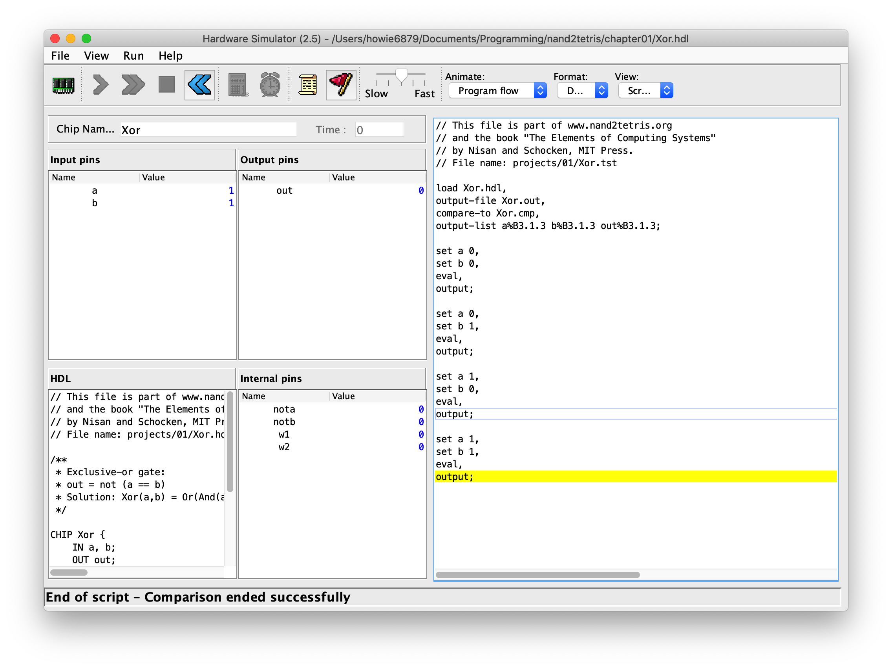

# nand2tetris 

<h2 align=center>

</h2>

> ✍️ 计算机系统要素-从零开始构建现代计算机，本书通过一系列的硬件和软件实践项目，向读者展示计算机科学知识中的大部分核心内容，如：硬件、体系架构、操作系统、程序设计语言、编译器、数据结构与算法、软件工程，带领大家从零开始构建计算机系统。

## 😼 概述

从下到上，从硬件到软件，将计算机完全全模块化，由浅人深地讲解计算机系统知识。

请先下载[./files/nand2tetris.zip](./files/nand2tetris.zip)文件并解压，开始前请确保配置好`Java`相关环境(以Mac为例):

```shell
java -version

# Output
# openjdk version "1.8.0_252"
# OpenJDK Runtime Environment (AdoptOpenJDK)(build 1.8.0_252-b09)
# OpenJDK 64-Bit Server VM (AdoptOpenJDK)(build 25.252-b09, mixed mode)

# 赋权
chmod u+x {YOUR_PATH}/nand2tetris/tools/*.sh
# 设置环境变量
echo "export PATH=$PATH:{YOUR_PATH}/nand2tetris/tools" >> ~/.bash_profile
source ~/.bash_profile

# 运行软件
HardwareSimulator.sh
```

`Windows`环境设置也很简单，具体见[nand2tetris-software](https://www.nand2tetris.org/software)，打开软件`HardwareSimulator`，然后加载[./chapter01/Xor.tst](Xor.tst)，运行：



## 🎯 规划

学习规划：
- [ ] [第一章：布尔逻辑](./chapter01/) ⏰ 21-11-01~21-11-07
- [ ] [第一章：布尔运算](./chapter01/) ⏰ 

##  👀 资料

学习资源如下：
- [官网](https://www.nand2tetris.org/)
- [coursera 课程地址](https://www.coursera.org/learn/build-a-computer/home/welcome)
- [B 站带中文字幕视频](https://www.bilibili.com/video/BV1KJ411s7QJ?p=1)
- [woai3c/nand2tetris 答案仓库](https://github.com/woai3c/nand2tetris)

关于开发：
- [vscode插件-vscode-nand2tetris-hdl](https://github.com/roblourens/vscode-nand2tetris-hdl)
